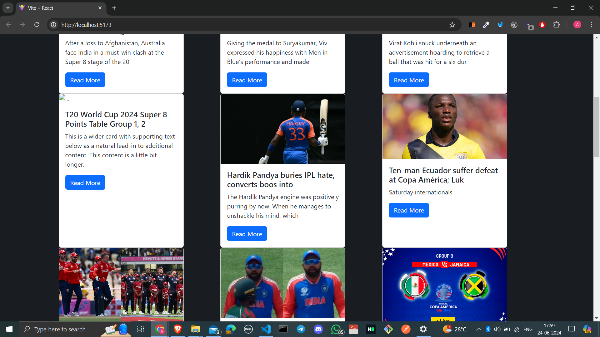

# React + Vite

This template provides a minimal setup to get React working in Vite with HMR and some ESLint rules.

Currently, two official plugins are available:

- [@vitejs/plugin-react](https://github.com/vitejs/vite-plugin-react/blob/main/packages/plugin-react/README.md) uses [Babel](https://babeljs.io/) for Fast Refresh
- [@vitejs/plugin-react-swc](https://github.com/vitejs/vite-plugin-react-swc) uses [SWC](https://swc.rs/) for Fast Refresh


# Notes

The News home page is looking like this you can clearly see that the card is either stretched or compresed.

## How can we maintain a same height mad weidth??




```javaScript

// SecondPostCard.jsx :
import React from "react";
import oops from "../../Images/OOPs.webp"
import { Link } from "react-router-dom";

export default function SecondPostCard({ article }) {
  return (
    <div className="card" style={{width: "20rem", height: "100%"}} >
        
        <div className="card-body"> // changed
            <h5 className="card-title">{article?.title?.substring(0, 50) || "Card title"}</h5>
            <p className="card-text">{article?.description?.substring(0, 100) || "This is a wider card with supporting text below as a natural lead-in to additional content. This content is a little bit longer."}</p>
            <a to="/" className="btn btn-primary">Read More</a>
        </div>
    </div>
  );
}


// insted of the line 

 <div className="card-body">

//  this css is introduced 

 <div className="card-body d-flex flex-column justify-content-between">

```

